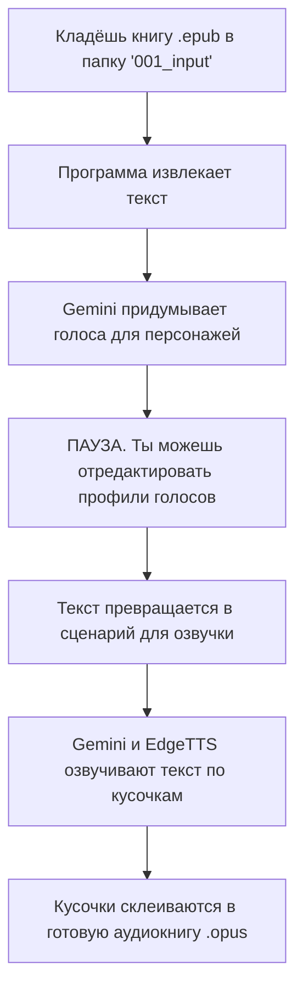

# ProjectScribe: Превращаем книги в аудиосериалы

Привет! Эта штука берёт твою любимую книжку в формате `.epub` и превращает её в аудиокнигу. Не просто читает одним голосом, а пытается создать что-то вроде аудиосериала с разными голосами для персонажей.

Процесс небыстрый, и иногда нейросеть (Google Gemini) капризничает, но результат того стоит.

## Послушай пример

Прежде чем начать, зацени, что получается на выходе. Стоит ли оно твоего времени?

[Пример аудиодорожки (Глава 10)](https://github.com/vadash/ProjectScribeRelease/releases/download/6.4/khameleon10-part001.opus)

## Как это работает?

Если коротко, то программа прогоняет книгу через несколько этапов. Вот общая схема:



На этапе 3 создаётся файл `character_profiles.jsonl`. В нём — описание голосов для главных героев. На этапе 6, если Gemini отказывается озвучивать какой-то кусок (такое бывает, особенно с откровенными сценами), программа 3 раза попробует снова, а потом подключит запасной вариант — одноголосый синтезатор EdgeTTS. Так что книга будет доделана в любом случае.

## Подготовка к работе: один раз и надолго

Да, тут придётся немного повозиться, но это делается только один раз.

### Шаг 1: Получаем ключи Google AI

Нам нужны бесплатные ключи от Google.

1.  **Создай новый гугл-аккаунт.** Лучше свежий, на всякий случай. На android телефоне можно извлечь сим, перезагрузить и даст создать один аккаунт без номера телефона.
2.  **Зайди в [Google Cloud Console](https://console.cloud.google.com/).** Тебе предложат 300$ — смело отказывайся, они нам не нужны.
3.  **Создай новый проект.** Нажми `CTRL + O` или найди кнопку создания проекта. Дай ему любое простое имя.
4.  **Повтори пункт 3** столько раз, сколько сможешь (обычно 10-15). Больше проектов — больше бесплатных запросов к нейросети.
5.  **Получи API ключи.** Перейди на [страницу Google AI Studio](https://aistudio.google.com/apikey). Для каждого созданного проекта получи свой API ключ и сохрани их все в блокнот.

### Шаг 2: Настраиваем Cloudflare Worker

Это наш сервер-прокладка, чтобы Google не забанил наши ключи.

1.  **Скачай архив `openai-gemini-mod-public.7z`** с [последнего релиза](https://github.com/vadash/ProjectScribeRelease/releases). Внутри несколько `.zip` архивов, они все одинаковые, бери любой.
2.  **Зарегистрируйся на [Cloudflare](https://dash.cloudflare.com/)**.
3.  **Создай Worker.** Перейди в `Workers & Pages` -> `Create application` -> `Create Worker`. Дай ему имя и нажми `Deploy`.
4.  **Загрузи архив.** Нажми `Upload zip` и выбери `.zip` файл из пункта 1. Скорее всего, будет ошибка — это нормально.
5.  **Настрой совместимость.** Иди в `Settings` -> `Compatibility Flags` и добавь флаг `nodejs_compat`.
6.  **Добавь ключи.** В `Settings` -> `Variables` -> `Environment Variables` добавь все ключи из блокнота (из Шага 1).
    *   Имя переменной: `KEY1`, `KEY2`, ... `KEY15` (цифры не важны, главное, чтобы имя начиналось с `KEY`).
7.  **Добавь пароль.** Тут же создай переменную `PASS` и задай ей случайное, но надёжное значение. Это твой пароль для доступа к серверу.
    
8.  **Перезагрузи архив.** Вернись на главную страницу воркера и снова загрузи тот же `.zip` файл. Теперь ошибки быть не должно.

### Шаг 3: Устанавливаем всё для клиента

Осталось настроить программу на твоём компьютере.

1.  **Установи .NET 9.** Скачай и установи [Runtime Desktop](https://dotnet.microsoft.com/en-us/download/dotnet/thank-you/runtime-desktop-9.0.7-windows-x64-installer).
2.  **Установи ffmpeg.**
    *   Скачай `ffmpeg-master-latest-win64-gpl.zip` с [официального сайта сборок](https://github.com/BtbN/FFmpeg-Builds/releases).
    *   Распакуй архив в удобное место, например `C:\ffmpeg`.
    *   Добавь путь к папке `bin` (в нашем примере `C:\ffmpeg\bin`) в системную переменную `PATH`.
    

## Запуск конвертации: шаг за шагом

### Шаг 1: Настраиваем клиент

1.  **Скачай и распакуй `ProjectScribe_XXX.7z`** с [последнего релиза](https://github.com/vadash/ProjectScribeRelease/releases).
2.  **Создай файл `.env`** в корневой папке программы. Впиши в него свой пароль от Cloudflare Worker (из Шага 2, пункт 7).
    ```
    OpenAi__OpenAiApiKey="твой_пароль_из_переменной_PASS"
    Tts__GeminiTtsApiKey="твой_пароль_из_переменной_PASS"
    ```
3.  **Отредактируй `config.json`**.
    *   `OpenAiApiEndpoint` и `GeminiTtsApiEndpoint`: Укажи адрес своего воркера (его можно найти на главной странице воркера в Cloudflare) и добавь в конце `/v1/chat/completions/1` и `/tts/1` соответственно.
        *   Пример: `https://my-worker-name.pages.dev/v1/chat/completions/1`
    *   `BaseLibraryDirectory`: Укажи путь к папке, где будут храниться твои книги. **Важно:** используй двойные обратные слэши (`\\`).
        *   Пример: `"BaseLibraryDirectory": "C:\\AudioBooks\\"`

### Шаг 2: Готовим библиотеку

Программа ищет книги в определённой структуре.

1.  В папке, которую ты указал в `BaseLibraryDirectory`, создай подпапку `001_input`.
2.  Внутри `001_input` **обязательно создай ещё две вложенные папки**. Обычно это `Автор\Название серии` или что-то в этом роде.
3.  И уже в самую последнюю папку клади файл книги `.epub`.

**Пример правильной структуры:**
`C:\AudioBooks\001_input\Анджей Сапковский\Ведьмак\Последнее желание.epub`

### Шаг 3: Запускаем программу

Просто запусти `ProjectScribe.Console.exe`. Откроется консольное окно, и процесс пойдёт. Программа сама найдёт новую книгу и начнёт её обрабатывать.

### Шаг 4: Редактируем профили персонажей (важный момент!)

В какой-то момент программа создаст файл `character_profiles.jsonl` (в папке с книгой, например `C:\AudioBooks\020_profilegen_input\...\character_profiles.jsonl`).

**В этот момент консоль остановится и будет ждать тебя!**

Это твой шанс повлиять на голоса. Открой `character_profiles.jsonl` в текстовом редакторе, посмотри, какие голоса Gemini подобрал для персонажей. Ты можешь их подправить (например, сделать голос ниже/выше, изменить темп речи). Сохрани файл.

Когда закончишь редактировать, вернись в окно консоли и **нажми любую клавишу**, чтобы продолжить.

## Что-то пошло не так? (Типичные проблемы)

### Как сбросить прогресс конвертации?

Если что-то зависло или результат не нравится, и ты хочешь начать сначала:
1.  Удали папку `data` из корневой папки программы.
2.  В своей библиотеке (`C:\AudioBooks`) удали все папки с номерами, **кроме `001_input`**.

### Ошибки таймаутов в Cloudflare

Если в логах много ошибок про `timeout`, значит, Gemini не успевает обработать кусок текста.
*   Открой `config.json`.
*   Найди параметр `TextBlockTargetCharCount` и попробуй уменьшить его значение (например, с `1600` до `1400`).

### Книга не конвертируется (возможно, битый epub)

Некоторые `.epub` файлы могут быть с ошибками.
1.  Скачай и установи редактор [Sigil](https://sigil-ebook.com/sigil/download).
2.  Открой в нём свой `.epub` файл. Sigil, скорее всего, найдёт ошибки и предложит их исправить.
3.  Согласись и просто пересохрани файл.

## Для продвинутых: Настройки в `config.json`

*   `MaxConcurrentTtsThreads`: Количество одновременных потоков для озвучки. Для бесплатного плана Cloudflare лучше оставить `2`.
*   `TextBlockTargetCharCount`: Размер куска текста для озвучки. Больше — лучше качество, но выше шанс словить таймаут. Меньше — надёжнее, но может быть больше "швов" в итоговом файле.
*   Папка `prompts`: Здесь лежат промпты, которые программа использует для общения с Gemini. Их можно менять, если хочешь поэкспериментировать.

## Планы на будущее
- Поддержка `.txt` и `.fb2`.
- Добавление словарей для правильных ударений.
